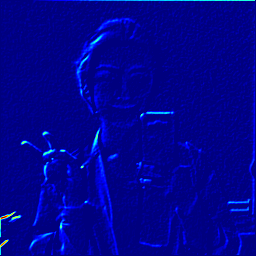

# TDAforCNN
this script performs Topological Data Analysis on Convolutional Neural Network featuremaps using VGG CNN on Caffe framework https://github.com/BVLC/caffe/wiki/Model-Zoo and using mapper http://danifold.net/mapper/ toolkit 

I turned my girlfriend's images into featuremaps

+

Then I performed topological data analysis on thoose activations 

